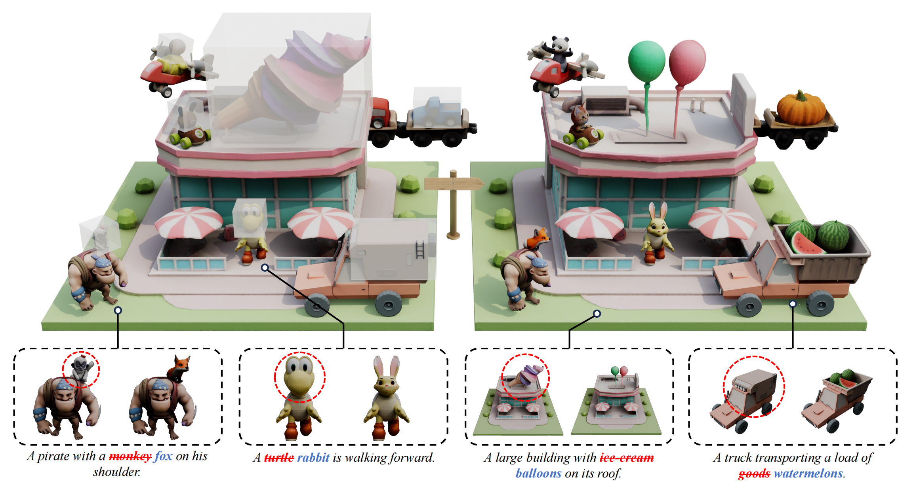

# VoxHammer: Training-Free Precise and Coherent 3D Editing in Native 3D Space

## 🏠 [Project Page](https://huanngzh.github.io/VoxHammer-Page/) | [Paper](https://arxiv.org/abs/2508.19247) | [Edit3D-Bench](https://huggingface.co/datasets/huanngzh/Edit3D-Bench) | [Online Demo (Comming soon)](https://huggingface.co/spaces/VAST-AI/MIDI-3D)



**TL;DR:** A training-free 3D editing approach that performs precise and coherent editing in native 3D latent space instead of multi-view space.

## 🔥 Updates

* [2025-08-27] Release inference code and Edit3D-Bench.

## 📦 Installation

### Prerequisites

- **System**: Linux (Ubuntu 20.04/22.04 recommended)  
- **GPU**: NVIDIA GPU with at least **40 GB** memory (an A100 80GB is strongly recommended)  
- **Python**: 3.10  
- **Conda** (Miniconda/Anaconda) recommended  

---

### Installation Steps

1. Create and activate the environment
```bash
conda create -n hammer python=3.10 -y
conda activate hammer
```

2. Install requirements from `requirements.txt`
```bash
pip install -r requirements_pip.txt
``` 

3. Install requirements from GitHub projects
```bash
pip install git+https://github.com/huanngzh/bpy-renderer.git
pip install git+https://github.com/NVlabs/nvdiffrast.git
pip install git+https://github.com/EasternJournalist/utils3d.git@9a4eb15e4021b67b12c460c7057d642626897ec8
git clone https://github.com/autonomousvision/mip-splatting.git /tmp/extensions/mip-splatting
pip install /tmp/extensions/mip-splatting/submodules/diff-gaussian-rasterization/
```

## 💡 Usage

### Step 1 — Create a 3D mask
Prepare a mesh that marks the editable region (e.g. `assets/example/mask.glb`).  

Inputs required:  
- `assets/example/model.glb` — original 3D asset  
- `assets/example/mask.glb` — mask mesh  

### Step 2 — Render RGB views & masks
```bash
python utils/render_rgb_and_mask.py   --source_model assets/example/model.glb   --mask_model assets/example/mask.glb   --output_dir output_dir
```

### Step 3 — Inpaint the rendered views
```bash
python utils/inpaint.py   --image_path example/images/2d_render.png   --mask_path example/images/2d_mask.png   --output_dir outputs/images   --prompt "A dog."
```

### Step 4 — Run inference
```bash
python inference.py   --input_model assets/example/model.glb   -mask_model assets/example/mask.glb   --image_dir assets/example/images   --output_dir output_dir
```

## Evaluation

Explore [Edit3D-Bench](./Edit3D-Bench/) for more details.

## Citation

```
@article{li2025voxhammer,
    title = {VoxHammer: Training-Free Precise and Coherent 3D Editing in Native 3D Space},
    author = {Li, Lin and Huang, Zehuan and Feng, Haoran and Zhuang, Gengxiong and Chen, Rui and Guo, Chunchao and Sheng, Lu},
    journal = {arXiv preprint arXiv:2508.19247},
    year = {2025}
}
```
